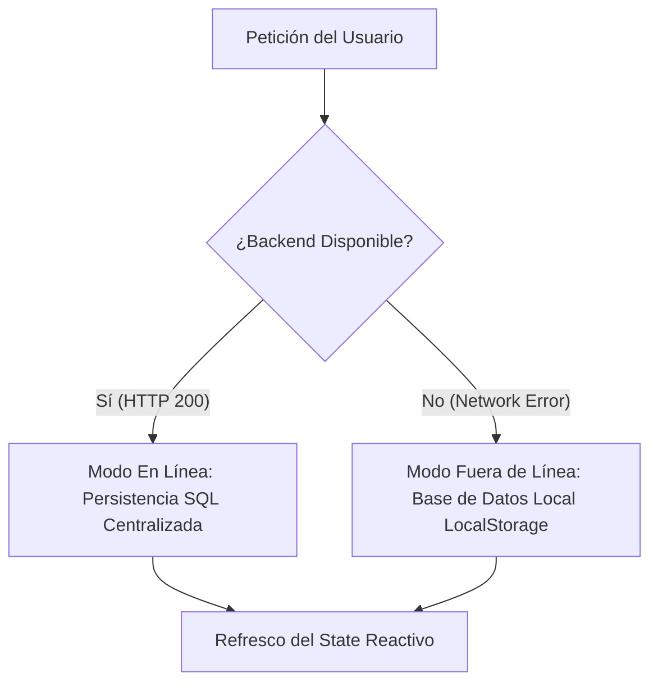

# 🏛️ EduPerformance — Portal de Experiencia Académica (Front-End)

EduPerformance es una plataforma web de alto rendimiento y estética ultra-premium (Enterprise-Grade) diseñada para la gestión académica y analítica educativa en tiempo real. Construido con **React** y **Vite**, el frontend ofrece interfaces interactivas para administrativos, docentes y estudiantes con transiciones dinámicas, gráficos interactivos en SVG y una experiencia visual futurista con efecto de vidriocristal (glassmorphism) y shaders de fondo acelerados por hardware.

---

## 🎨 Sistema de Diseño y Estética Visual

La interfaz de usuario ha sido pulida para ofrecer una experiencia visual excepcional y un flujo operativo libre de fricciones:

*   **Tema Neon-Glassmorphic:** Fondos oscuros profundos con esferas luminosas difuminadas de fondo y tarjetas translúcidas con bordes finos de alto contraste.
*   **Cumplimiento de Accesibilidad (WCAG):** Elementos de navegación inactivos (`nav-item`, `tab-pill`) y textos secundarios ajustados a un contraste de `rgba(255, 255, 255, 0.88)` para garantizar una legibilidad óptima en cualquier pantalla.
*   **Filtros de Prevención de Errores:** Botones de acción críticos (Editar / Eliminar) ampliados en tamaño táctil y separados mediante espaciados controlados (de hasta `16px`) para evitar clics erróneos.
*   **Shaders Interactivos:** Fondo dinámico con efectos de distorsión fluida en la pantalla de login gracias a la integración de shaders gráficos (`@paper-design/shaders-react`).

---

## ⚡ Modos de Conectividad (Arquitectura Híbrida)

EduPerformance cuenta con una capa de servicio robusta basada en **Axios** que gestiona la contingencia ante caídas de red de forma transparente para el usuario:



*   **Modo En Línea (Online):** Realiza operaciones asíncronas con el backend de Spring Boot (`http://localhost:8080/api`), enviando y recibiendo DTOs planos estructurados, garantizando consistencia relacional.
*   **Modo Fuera de Línea (Offline):** Si la red falla, el frontend conmuta automáticamente a una base de datos local simulada en `localStorage` (`db`). Las operaciones CRUD (crear estudiantes, subir calificaciones, tomar asistencias) siguen funcionando y se renderizan al instante de forma reactiva en el cliente.

---

## 🖥️ Módulos e Interfaces (Portales de Usuario)

La aplicación implementa rutas y vistas protegidas según el perfil de seguridad cargado en sesión:

### 🛡️ 1. Consola de Control Administrativo (`AdminDashboard.jsx`)
Destinada a las tareas de configuración global e integridad del sistema:
*   **Gestión CRUD General:** Registro y control de estudiantes y profesores.
*   **Configuración del Periodo:** Definición del semestre activo y fecha/hora límite de actas.
*   **Bloqueo de Calificaciones:** Interruptor general de seguridad que restringe a los docentes la edición de notas.
*   **Consola de Auditoría Interactiva:** Visor dinámico que reporta eventos y operaciones críticas del sistema en vivo.
*   **Respaldos de Datos (Backups):** Exportación en un clic de la base de datos a formato JSON y restablecimiento completo a valores de fábrica.

### 👨‍🏫 2. Portal Docente (`TeacherDashboard.jsx`)
Enfocado en la gestión de materias y la evaluación continua:
*   **CRUD de Asignaturas:** Administración de cursos y asignación de horarios.
*   **Planilla de Notas:** Carga de calificaciones evaluativas con validación estricta de rango (`0.0 - 5.0`) y ponderaciones porcentuales.
*   **Toma de Asistencia (Bulk):** Paso de lista masivo y dinámico con restricción para evitar el registro de fechas futuras (contingencia anti-fraude).
*   **Curvas de Rendimiento (SVG):** Gráfico vectorizado interactivo que dibuja la media académica de cada curso en tiempo real.

### 👨‍🎓 3. Portal del Estudiante (`StudentDashboard.jsx`)
Diseñado para la consulta ágil del alumno:
*   **Reporte de Calificaciones:** Visualización de notas, actividades evaluadas y observaciones individuales del profesor.
*   **Seguimiento de Asistencia:** Historial detallado de presencia/ausencia en las materias inscritas.
*   **Indicadores de Estado:** Tarjetas con el promedio general ponderado y tasa de asistencia acumulada.

> [!TIP]
> Para conocer a fondo el alcance de permisos y restricciones operativas de cada perfil de usuario, consulta la guía formal: **[Alcances de Perfiles](file:///c:/Users/saate/OneDrive%20-%20Universidad%20de%20Antioquia/Documentos%20importantes/CESDE/Pruebas%20front/Implementacion%20AXIOS%20Final/EduPerformanceFront/Alcances_Perfiles_EduPerformance.md)**.

---

## 🛠️ Tecnologías Utilizadas (Stack Tecnológico)

*   **Core:** React JS (versión 18+)
*   **Construcción & Bundle:** Vite
*   **Gestión de Estado:** React Context API + Custom Hooks
*   **Librería de Iconos:** Lucide-React
*   **Peticiones HTTP:** Axios con interceptores de red
*   **Fondo Dinámico:** Shaders WebGL (`@paper-design/shaders-react`)
*   **Estilización:** CSS3 Vanilla con variables y gradientes de color HSL de alto contraste.

---

## 🚀 Instalación y Despliegue Local

Sigue los pasos a continuación para ejecutar el portal en tu entorno de desarrollo local:

### 1. Prerrequisitos
Tener instalado [Node.js](https://nodejs.org/) (versión 18 o superior recomendada) y `npm`.

### 2. Clonación e Instalación de Dependencias
Abre la terminal en la raíz de esta carpeta (`EduPerformanceFront`) e instala las librerías necesarias:
```bash
npm install
```

### 3. Configuración de Variables de Entorno
La dirección de la API del Backend se configura mediante el archivo `.env` en la raíz del frontend:
```env
VITE_API_URL=http://localhost:8080/api
```

### 4. Lanzar Servidor de Desarrollo
Inicia el servidor local de desarrollo optimizado con Vite:
```bash
npm run dev
```
Abre la URL provista por la consola (por defecto: `http://localhost:5173`) en tu navegador preferido.

### 5. Generación del Compilado de Producción
Para compilar la aplicación en un paquete optimizado y minificado listo para subir a un servidor web:
```bash
npm run build
```
Los archivos estáticos resultantes se guardarán en el directorio `/dist`.
